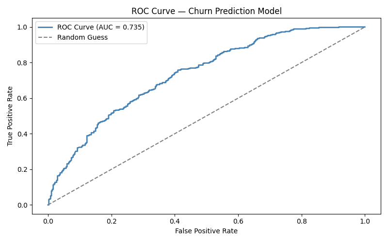
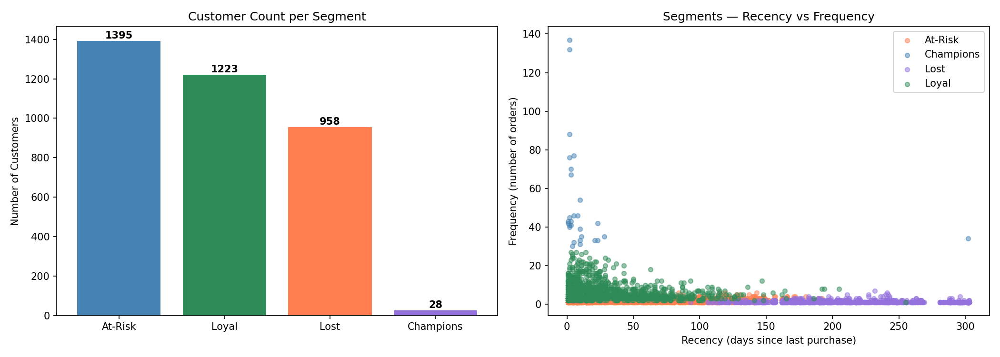
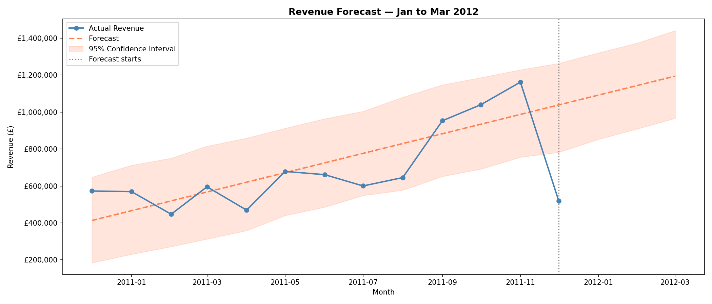

# Customer Intelligence Platform

  An end-to-end machine learning platform that transforms raw retail transactions
  into actionable customer intelligence — combining churn prediction, customer
  segmentation, product recommendations, and revenue forecasting.

  ---

  ## What It Does
  
  | Module | Method | Output |
  |---|---|---|
  | Churn Prediction | XGBoost + GridSearchCV | 74% ROC-AUC, identifies at-risk customers |
  | Customer Segmentation | K-Means (K=4) | Champions, Loyal, At-Risk, Lost |
  | Product Recommendations | Item-based Collaborative Filtering | Top-5 per customer |
  | Revenue Forecasting | Facebook Prophet | 3-month forward forecast |
  | Pipeline Automation | Apache Airflow DAG | Full pipeline in one command |

  ---

  ## Key Results

  - **£1.38M revenue at risk** identified from churned customers (22.5% of base)
  - **2,162 customers** received personalised recommendations via collaborative filtering
  - **28 Champion customers** averaging £46,590 spend — outsized retention priority
  - **Revenue forecast:** £1.04M–£1.19M/month projected for Q1 2012
  - **Full pipeline runs end-to-end** in a single command: python run_pipeline.py

  ---

  ## Dataset
  
  [UCI Online Retail Dataset](https://archive.ics.uci.edu/ml/datasets/Online+Retail)
  — 400K+ transactions, Dec 2010–Dec 2011, UK-based retailer.

  Download Online Retail.xlsx and place it in the data/ folder before running.

  ---
  
  ## Project Structure
\'''
 
  customer-intelligence-platform/
  ├── data/                          # Input and output data files
  │   ├── rfm_with_churn.csv         # Customer features + churn labels
  │   ├── rfm_segmented.csv          # Customers with segment assignments
  │   ├── recommendations.csv        # Product recommendations per customer
  │   └── revenue_forecast.csv       # Monthly revenue forecast
  ├── notebooks/
  │   ├── 01_exploration.ipynb       # Data exploration
  │   ├── 02_cleaning.ipynb          # Data cleaning
  │   ├── 03_feature_engineering.ipynb
  │   ├── 04_churn_prediction.ipynb  # XGBoost + MLflow + GridSearchCV
  │   ├── 05_segmentation.ipynb      # K-Means clustering
  │   ├── 06_recommendations.ipynb   # Collaborative filtering
  │   └── 07_revenue_forecast.ipynb  # Prophet forecasting
  ├── pipeline/                      # Production pipeline modules
  │   ├── clean.py
  │   ├── features.py
  │   ├── churn.py
  │   ├── segment.py
  │   ├── recommend.py
  │   └── forecast.py
  ├── dags/
  │   └── customer_intelligence_dag.py   # Airflow DAG
  ├── run_pipeline.py                # Standalone pipeline runner
  └── requirements.txt
\'''
  ---
  
  ## Setup

 
bash
  git clone https://github.com/YOUR_USERNAME/customer-intelligence-platform.git
  cd customer-intelligence-platform

  python -m venv venv
  source venv/bin/activate        # Windows: venv\Scripts\activate

  pip install -r requirements.txt
 
  
  Place Online Retail.xlsx in the data/ folder (download from UCI link above).

  ---
  
  ## Run the Full Pipeline

 
bash
  python run_pipeline.py                                                                                                                                                                                                               
 

  This runs all 6 steps in sequence:

 
  [1/6] Cleaning data...
  [2/6] Engineering features...
  [3/6] Training churn model...
  [4/6] Segmenting customers...
  [5/6] Generating recommendations...
  [6/6] Forecasting revenue...
  Pipeline complete. All outputs saved to data/
 

  ---

  ## Methodology Highlights

  ### Churn Prediction — Preventing Data Leakage
  A naive churn model defines Churn = 1 if Recency >= 90 days and uses
  Recency as a feature — the model just learns to read the answer.

  We use a **time-based split** instead:
  - **Feature window (Dec 2010–Sep 2011):** compute all customer features here
  - **Observation window (Oct–Dec 2011):** if no purchase → Churned

  Features come from the past. Labels come from the future. No leakage.

  ### Hyperparameter Tuning
  GridSearchCV across 108 combinations with 5-fold cross-validation (540 fits total).
  Best params: max_depth=3, n_estimators=200, learning_rate=0.05, subsample=0.9

  ### Segmentation — Choosing K
  Elbow method + Silhouette score evaluated across K=2 to K=10.
  K=4 chosen as the optimal balance between mathematical fit (silhouette=0.37)
  and business interpretability.

  ---

  ## Tech Stack

  Python · XGBoost · Scikit-Learn · MLflow · Prophet · Apache Airflow
  · Pandas · NumPy · Matplotlib · Seaborn

  ---

  ## Results Visualisations

  | Churn Model | Customer Segments | Revenue Forecast |
  |---|---|---|
  |  |  |  |